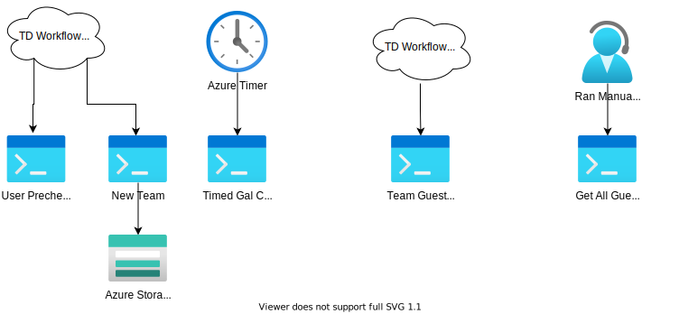

---
Graph:
  Endpoint: https://graph.microsoft.com/
  Versions: v1.0, beta
  Rest Options: Post,Get
Powershell Compatibility:
  PS 5.1:
    Y/N: ✖
    Notes: Invoke-RestMethod commands are using the newer Authentication parameter, not compatible with 5.1
  PS 6.2+:
    Y/N: ✔
    Notes: N\A
  PS 7.0+:
    Y/N: ✔
    Notes: N\A
---

# Generate Teams

This repository contains the code used for azure functions allowing a single Rest Post request to generate a new Microsoft Teams team based off of the information provided. This was originally created for use with TDx Web Request features to automate our workflows when creating Microsoft Teams.

## Table Of Contents

- [Generate Teams](#generate-teams)
  - [Table Of Contents](#table-of-contents)
  - [Requirements](#requirements)
  - [Setup](#setup)
    - [Required Modules](#required-modules)
    - [Hardcoded Script Values](#hardcoded-script-values)
    - [TDx configuration](#tdx-configuration)
      - [TDx User account permission](#tdx-user-account-permission)
      - [Web Service Auth Account](#web-service-auth-account)
      - [Web Service Provider](#web-service-provider)
  - [Workflow and Usage](#workflow-and-usage)
  - [REST Examples](#rest-examples)
    - [Example Hostname](#example-hostname)
  - [Additional Notes](#additional-notes)
    - [Graph Settings](#graph-settings)
    - [Connect-ExchangeOnline](#connect-exchangeonline)
    - [Team Discovery Settings](#team-discovery-settings)
      - [Current user based Options for Teams Membership](#current-user-based-options-for-teams-membership)

## Requirements

- Service (User) Account
- Azure App Registration
  - Application (client) ID
  - Client Secret
  - Graph Permissions:
    | Graph API Permission       | Type        | Description                         | Admin Consent Required |
    | -------------------------- | ----------- | ----------------------------------- | ---------------------- |
    | Directory.ReadWrite.All    | Application | Read and write directory data       | Yes                    |
    | Group.ReadWrite.All        | Application | Read and write all groups           | Yes                    |
    | Team.Create                | Application | Create teams                        | Yes                    |
    | Team.ReadBasic.All         | Application | Get a list of all teams             | Yes                    |
    | TeamSettings.ReadWrite.All | Application | Read and change all teams' settings | Yes                    |
- Azure Resource Group
  - Technically optional, used to store and organize all of these resources mentioned.
- Azure App Service
- Azure Storage Account
  - Azure Storage Queue
  - Azure Storage Table
  - >NOTE: Account name and key are not directly used in this script, instead the `function.json` files use the default "AzureWebJobsStorage" connection which provides this information to the functions.

## Setup

- Generate the Azure App Registration
  - Set the proper Graph permissions (listed in the requirement section)
  - Make note of the Application (client) ID
    - Generate a new client secret (description does not matter)
    - > NOTE: Make note of the new client secret, you will not be able to view it later, if lost, a new client secret needs to be generated.
  - > NOTE: The name of the App Registration will be visible when the team is created and the requestor is invited, Teams uses the name of the app registration for the notification and invites displayed in Microsoft Teams.
- Create a new Azure Resource Group, this will be used to "store" all of the additional components
- Create an azure storage account
  - Create a new Azure Storage Queue and Table
    - Make note of both the Queue and Table name, they will be needed later
- Create a new App Service
  - The code from this Repo can be cloned down from git or use an SFTP transfer the file to the app service.
  - >NOTE: Review the `local.settings.json.template` "values" section for a list of attributes that will need to exist in the "application settings and configuration" in the app service (set these using the Azure Portal GUI).
- Review the hardcoded values section below and ensure that those entries are updated to match the current Azure storage.

### Required Modules

No external modules are required.

### Hardcoded Script Values

There are a few hardcoded values that are based on the configuration of the Azure Storage, These must match the name of their respective Azure Queue, Table, or Resource Group. Casing is very important for these values.

- `NewTeam\function.json`
  - QueueName
  - TableName
- `TimedGalChanges\function.json`
  - QueueName
- `TimedGroupCheck\function.json`
  - TableName
- `TimedGalChanges\run.ps1`
  - QueueName
  - ResourceGroup

### TDx configuration

#### TDx User account permission

  | Application   | Security Role                                      |
  | ------------- | -------------------------------------------------- |
  | Chat          | ✔                                                  |
  | Client Portal | Client + Knowledge Base, Services, Ticket Requests |
  | Community     | ✔                                                  |
  | IT            | Technician                                         |
  | TDNext        | ✔                                                  |

#### Web Service Auth Account

  | Name                       | type                | active |
  | -------------------------- | ------------------- | ------ |
  | Existing user account Name | TeamDynamix Web API | ✔      |

#### Web Service Provider

  | Name                | Base Service Provider URL                                                                  | Active |
  | ------------------- | ------------------------------------------------------------------------------------------ | ------ |
  | Azure Teams Creator | [https://AzureAppName.azurewebsites.net/api/](https://AzureAppName.azurewebsites.net/api/) | ✔      |

## Workflow and Usage



- `UserPrecheck` Function is triggered via a get request
  - Returns the queried user account and provides information regarding the user's licence status
- `NewTeam` Function is triggered via a post request
  - A new O365 Group is generated and populated with a single member (the owner of the group)
  - The group is then used to create a Microsoft Team via Microsoft Graph
    - >NOTE: Currently this is best practice, Graph API calls newer 1.* may have a single Graph Request to create a team rather than a two part process.
  - This function takes a mixture of the Group and Team attributes and posts the results to the azure table for long term logging
  - Shortly after the new team is created, the owner (the one and only member) will be granted access to the team and receive a notification if their teams client is running
  - A queue message is generated to the storage queue
- `TimedGALChanges` This function incrementally checks the storage queue to determine if there are any pending queue messages
  - If there are pending queue messages:
    - The function loads exchange, and attempts to set the visibility of the group in the GAL
      - If the function succeeds, the queue message is removed from the queue
      - If the function does not succeed, the queue message will be checked again the next time the function incrementally checks the queue
- `TeamGuestSettings` Function is triggered via a get or post request
  - Team guest access is either enabled or disabled, and returns the current setting values
- `GetAllGuestEnabledTeams`
  - Generates a list of all teams that currently allow guest access
  - supplemental function used as needed, is manually triggered

## REST Examples

View the readme file within each function's respective folder for more information.

### Example Hostname

```text
The name is based off of whatever the Azure Function App Service name is:
  Host: https://<FUNCTIONAPPNAME>.azurewebsites.net

Port 7071 is currently the default port when using the local azure function apps for testing:
  Host: localhost:7071

```

## Additional Notes

Additional comments regarding Graph, Powershell, Teams Roadmaps, ect...

### Graph Settings

- [TeamDiscoverySettings](https://docs.microsoft.com/en-us/graph/api/resources/teamdiscoverysettings?view=graph-rest-beta) within the Graph API is only available within beta
  - This includes the "ShowInTeamsSearchAndSuggestions" Graph API setting

### Connect-ExchangeOnline

- [App-only authentication for unattended scripts in the EXO V2 module](https://docs.microsoft.com/en-us/powershell/exchange/app-only-auth-powershell-v2?view=exchange-ps) currently only supports powershell desktop (PS 5.1)
  - Once this command is compatible with Powershell Core (6.2+, 7.0+) we should remove custom code to connect to exchange and use this method instead

### Team Discovery Settings

- [Discovery of Private teams within MS Teams](https://docs.microsoft.com/en-us/microsoftteams/manage-discovery-of-private-teams#:~:text=When%20a%20private%20team%20is%20discoverable%2C%20it%20shows,owner%20can%20then%20approve%20or%20deny%20the%20request.)
  - Feature is deprecated as of Aug 31 2020
    - Cannot enable discovery of Private teams
    - Cannot disable discovery of Public Teams
  - Alternate option to consider using policy:
    - [New-CsTeamsChannelsPolicy](https://docs.microsoft.com/en-us/powershell/module/skype/new-csteamschannelspolicy?view=skype-ps)

#### Current user based Options for Teams Membership

- Options for private teams to allow new members to join directly without approval
  - [Create and share a code](https://support.microsoft.com/en-us/office/create-a-link-or-a-code-for-joining-a-team-11b0de3b-9288-4cb4-bc49-795e7028296f)
